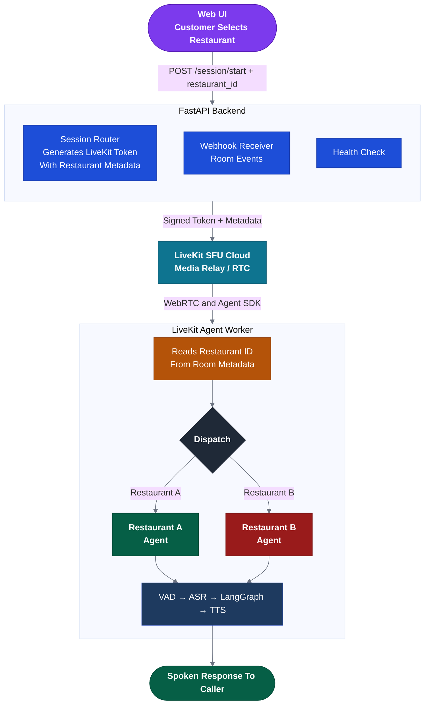
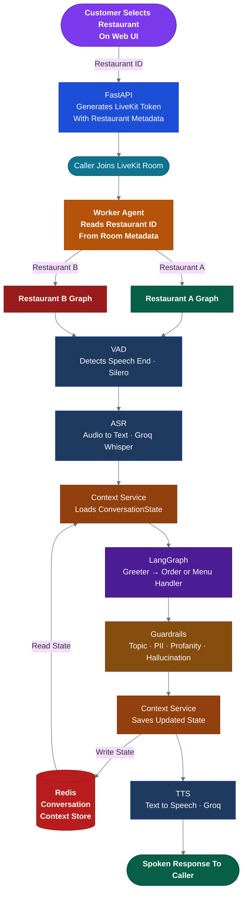
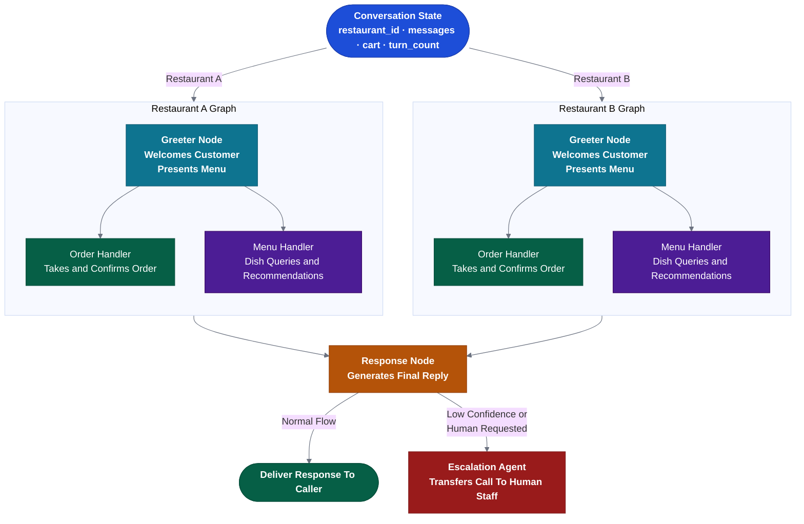

# Restaurant Voice Bot — Backend

A Real-Time AI Voice Waiter That Greets Customers, Presents The Menu, Recommends Dishes, And Takes Their Food Order Over A Natural Phone Conversation. The Customer Selects A Restaurant From The Web UI — The Correct Agent Is Then Triggered Automatically. Built On **FastAPI**, **LiveKit Agents**, And **LangGraph** With **Groq** As The LLM And Speech Provider.

---

## Table of Contents

- [Project Description](#project-description)
- [Dependencies](#dependencies)
- [Project Directory Structure](#project-directory-structure)
- [System Architecture](#system-architecture)
  - [High-Level Overview](#high-level-overview)
  - [Component Breakdown](#component-breakdown)
  - [Data Flow](#data-flow)
  - [LangGraph Agent Pipeline](#langgraph-agent-pipeline)
- [Getting Started](#getting-started)
- [Environment Variables](#environment-variables)
- [API Reference](#api-reference)

---

## Project Description

Restaurant Voice Bot Backend Is The Server-Side Engine For An AI Voice Waiter That Serves Two Restaurant Brands From A Single Deployment. The Customer Selects Their Restaurant From A Web UI — The Backend Generates A LiveKit Session Token Carrying The Restaurant ID As Metadata. The Agent Worker Reads That Metadata On Connection And Triggers The Correct Restaurant Agent Directly, With No In-Call Routing Step.

Once Connected, The Agent Greets The Customer In That Restaurant's Persona, Presents The Available Dishes From The Menu, Answers Questions, And Confirms The Order — Exactly Like A Human Waiter Over The Phone. Each Restaurant Has Its Own Isolated Agent With A Dedicated Prompt That Carries The Full Menu, Tone, And Brand Personality. Conversation Context Is Held Entirely In Redis For The Duration Of Each Call — There Is No Persistent Database. The Call Is Handed Off To A Human Staff Member If The Agent Cannot Confidently Assist.

---

## Dependencies

### Core Frameworks

| Package | Version | Purpose |
|---|---|---|
| `fastapi` | `^0.111` | REST API Server And Webhook Handlers |
| `uvicorn[standard]` | `^0.30` | ASGI Server |
| `livekit-agents` | `^0.8` | Real-Time Voice Agent Framework |
| `livekit-plugins-groq` | `^0.8` | Groq STT / TTS / LLM Plugins For LiveKit |
| `livekit-plugins-silero` | `^0.8` | Voice Activity Detection (VAD) |
| `langgraph` | `^0.1` | Stateful Agent Graph Orchestration |
| `langchain-core` | `^0.2` | LLM Abstraction, Tool Definitions, Message Schemas |
| `langchain-groq` | `^0.1` | Groq LLM Integration For LangChain / LangGraph |
| `groq` | `^0.9` | Groq API Client |

### Data & Storage

| Package | Version | Purpose |
|---|---|---|
| `redis[hiredis]` | `^5.0` | Conversation Context Store — Session State Per Active Call |
| `pydantic` | `^2.7` | Data Validation And Settings Management |
| `pydantic-settings` | `^2.3` | Environment-Based Configuration |

### Utilities

| Package | Version | Purpose |
|---|---|---|
| `python-dotenv` | `^1.0` | Local Environment Variable Loading |
| `httpx` | `^0.27` | Async HTTP Client For Third-Party Integrations |
| `tenacity` | `^8.3` | Retry Logic For External API Calls |
| `structlog` | `^24.2` | Structured JSON Logging |

### Development & Testing

| Package | Version | Purpose |
|---|---|---|
| `ruff` | `^0.4` | Linter And Formatter |
| `mypy` | `^1.10` | Static Type Checking |

---

## Project Directory Structure

> **Naming Convention:** Every File Is Suffixed With Its Architectural Role So The Purpose Is Unambiguous At A Glance.
>
> | Layer | Suffix | Example |
> |---|---|---|
> | FastAPI Router | `_router.py` | `session_router.py` |
> | LiveKit Agent | `_agent.py` | `voice_pipeline_agent.py` |
> | LangGraph Node | `_node.py` | `order_handler_node.py` |
> | LangGraph Graph | `_graph.py` | `orchestrator_graph.py` |
> | LLM Prompt Template | `_prompt.py` | `restaurant_a_prompt.py` |
> | LangChain Tool | `_tool.py` | `menu_tool.py` |
> | Guardrail | `_guardrail.py` | `topic_guardrail.py` |
> | Pydantic Schema (API) | `_schema.py` | `livekit_token_schema.py` |
> | Pydantic Schema (Agent I/O) | `_schema.py` | `orchestrator_schema.py` |
> | Business Logic Service | `_service.py` | `order_service.py` |
> | External Client Wrapper | `_client.py` | `livekit_client.py` |

```
Restaurant-Voice-Bot-Backend/
│
├── app/                                              # Application Source Root
│   │
│   ├── api/                                          # FastAPI Layer — Infrastructure Routes Only
│   │   ├── __init__.py
│   │   └── v1/                                       # Versioned API Surface
│   │       ├── __init__.py
│   │       ├── session_router.py                     # Accepts Restaurant Selection, Returns LiveKit Token With Restaurant Metadata
│   │       ├── webhook_router.py                     # Receives LiveKit Room And Participant Events
│   │       └── health_router.py                      # Liveness Probe For Load Balancers
│   │
│   ├── agents/                                       # LiveKit Voice Agent Layer
│   │   ├── __init__.py
│   │   ├── worker_agent.py                           # AgentWorker Entrypoint — Reads Restaurant ID From Session Metadata And Dispatches
│   │   ├── voice_pipeline_agent.py                   # Assembles VAD → ASR → LangGraph → TTS Pipeline
│   │   ├── session_agent.py                          # Per-Call Lifecycle: Connect, Turn, Disconnect
│   │   ├── restaurant_a_agent.py                     # Voice Waiter Agent For Restaurant A
│   │   ├── restaurant_b_agent.py                     # Voice Waiter Agent For Restaurant B
│   │   └── escalation_agent.py                       # Transfers Call To Human Staff When Needed
│   │
│   ├── prompts/                                      # LLM Prompt Templates — One File Per Agent Or Role
│   │   ├── __init__.py
│   │   ├── restaurant_a_prompt.py                    # Waiter Persona, Full Menu, And Brand Tone For Restaurant A
│   │   ├── restaurant_b_prompt.py                    # Waiter Persona, Full Menu, And Brand Tone For Restaurant B
│   │   └── escalation_prompt.py                      # Human Handoff Transition And Closing Message
│   │
│   ├── tools/                                        # LangChain Tool Definitions Invoked By Agent Nodes
│   │   ├── __init__.py
│   │   ├── menu_tool.py                              # Search Menu, Get Item Details
│   │   ├── order_tool.py                             # Add To Cart, Confirm Order, Get Order Status
│   │   └── escalation_tool.py                        # Notify Human Agent, Transfer Call
│   │
│   ├── graphs/                                       # LangGraph Conversation Graph Definitions
│   │   ├── __init__.py
│   │   ├── restaurant_a_graph.py                     # Full Conversation Graph For Restaurant A
│   │   ├── restaurant_b_graph.py                     # Full Conversation Graph For Restaurant B
│   │   ├── conversation_state.py                     # ConversationState TypedDict — Single Source Of Truth
│   │   ├── routing_edges.py                          # Conditional Edge Routing Functions
│   │   │
│   │   └── nodes/                                    # Individual Graph Node Handler Functions
│   │       ├── __init__.py
│   │       ├── greeter_node.py                       # Welcomes Customer And Presents Today's Menu
│   │       ├── order_handler_node.py                 # Manages Multi-Turn Order And Cart State
│   │       ├── menu_handler_node.py                  # Answers Dish Queries And Makes Recommendations
│   │       └── escalation_handler_node.py            # Graceful Handoff To Human Agent
│   │
│   ├── guardrails/                                   # Input And Output Safety Guardrails
│   │   ├── __init__.py
│   │   ├── base_guardrail.py                         # Abstract Guardrail Interface All Guards Extend
│   │   ├── topic_guardrail.py                        # Blocks Off-Topic Or Non-Restaurant Inputs
│   │   ├── pii_guardrail.py                          # Detects And Redacts Personally Identifiable Information
│   │   ├── profanity_guardrail.py                    # Filters Harmful Or Abusive Language
│   │   └── hallucination_guardrail.py                # Validates Agent Responses Against Known Menu Data
│   │
│   ├── schemas/                                      # All Pydantic Schemas Segregated By Concern
│   │   ├── __init__.py
│   │   │
│   │   ├── api/                                      # REST Request And Response Schemas
│   │   │   ├── __init__.py
│   │   │   ├── session_schema.py                     # SessionStartRequest, SessionStartResponse, LiveKitToken
│   │   │   └── webhook_schema.py                     # WebhookEvent, ParticipantEvent
│   │   │
│   │   ├── agent/                                    # Pydantic Input And Output Schemas For Graph Nodes And Tools
│   │   │   ├── __init__.py
│   │   │   ├── greeter_schema.py                     # GreeterInput, GreeterOutput
│   │   │   ├── order_schema.py                       # OrderHandlerInput, OrderHandlerOutput, CartItem
│   │   │   ├── menu_schema.py                        # MenuHandlerInput, MenuHandlerOutput, DishRecommendation
│   │   │   └── escalation_schema.py                  # EscalationInput, EscalationOutput
│   │   │
│   │   └── internal/                                 # Shared Internal DTOs Not Exposed Via API
│   │       ├── __init__.py
│   │       ├── session_schema.py                     # CallSession, TurnRecord
│   │       └── tenant_schema.py                      # TenantConfig, RestaurantContext
│   │
│   ├── services/                                     # Business Logic — Called By Routers And Agent Tools
│   │   ├── __init__.py
│   │   ├── context_service.py                        # Read And Write Conversation Context In Redis
│   │   ├── menu_service.py                           # Menu Retrieval For Active Session
│   │   └── order_service.py                          # Order Creation And Cart Management
│   │
│   ├── integrations/                                 # External Service Client Wrappers
│   │   ├── __init__.py
│   │   ├── livekit_client.py                         # LiveKit Server SDK — Token Generation, Room API
│   │   └── groq_client.py                            # Shared Async Groq Client Instance
│   │
│   ├── core/                                         # App-Wide Cross-Cutting Concerns
│   │   ├── __init__.py
│   │   ├── config.py                                 # Pydantic Settings — Reads From .env
│   │   ├── logging.py                                # Structlog JSON Logger Setup
│   │   └── exceptions.py                             # Domain Exception Hierarchy
│   │
│   └── main.py                                       # FastAPI App Factory, Router Registration, Lifespan
│
├── docker-compose.yml                                # Spins Up Local Redis Instance
├── .env                                              # Local Environment Variables — Never Commit
├── .env.example                                      # Annotated Template — Safe To Commit
├── .gitignore
└── README.md
```

---

## System Architecture

### High-Level Overview



---

### Component Breakdown

#### 1. FastAPI Backend (`app/api/`)

Handles Only Infrastructure And Session Initiation — Never Participates In The Conversation:

- **Session Endpoint** — Accepts The Restaurant ID Selected In The Web UI, Generates A Signed LiveKit Token With The Restaurant ID Embedded As Room Metadata, And Returns It To The Client.
- **Webhook Receiver** — Receives LiveKit Room Events (Room Opened, Participant Joined Or Left, Call Ended).
- **Health Check** — Liveness Probe For Load Balancers And Uptime Monitors.

#### 2. LiveKit Agent Worker (`app/agents/`)

A Long-Running Process That Connects To LiveKit And Drives The Voice Pipeline For Every Active Call:

- On Connection, Reads The Restaurant ID From The LiveKit Room Metadata And Dispatches To The Correct Restaurant Agent.
- Runs **VAD** (Silero) To Detect When The Caller Has Finished Speaking.
- Passes Audio To **ASR** (Groq Whisper) To Produce A Text Transcript.
- Invokes The Correct **LangGraph** Restaurant Graph With The Transcript And Current Session State.
- Streams The Text Response Through **TTS** (Groq) And Sends Audio Back To The Caller Via LiveKit.

#### 3. LangGraph Graphs (`app/graphs/`)

The Conversational Intelligence Layer Modelled As Directed Graphs:

- **`ConversationState`** — A Single TypedDict Shared Across All Nodes; Carries Messages, Cart, Restaurant ID, And Turn Count.
- **Restaurant A / B Graphs** — Isolated Graphs Per Restaurant; Each Starts With A Greeter Node That Welcomes The Customer And Presents The Menu, Then Routes To Order Or Menu Handler Nodes.
- **Escalation Agent** — Triggered By A Conditional Edge When Confidence Is Low Or The Caller Requests A Human.

---

### Data Flow



---

### LangGraph Agent Pipeline



---

## Getting Started

### Prerequisites

- Python 3.11+
- Docker And Docker Compose
- LiveKit Cloud Account
- Groq API Key

### 1. Start Redis

Redis Is The Only Infrastructure Dependency. The Provided `docker-compose.yml` Spins Up A Lightweight Redis 7 Container Bound To `localhost:6379`.

```bash
# Start Redis Container In The Background
docker-compose up -d

# Verify Redis Is Running
docker-compose ps

# Stop Redis When Done
docker-compose down
```

> Redis Data Is Intentionally Not Persisted — Session Context Lives Only For The Duration Of A Call.

### 2. Install Dependencies

```bash
# Clone The Repository
git clone https://github.com/arko700/Restaurant-Voice-Bot-Backend.git
cd Restaurant-Voice-Bot-Backend

# Create And Activate Virtual Environment
python -m venv .venv
source .venv/bin/activate

# Install Dependencies
pip install -e ".[dev]"
```

### 3. Configure Environment

```bash
# Copy The Example File And Fill In Your Credentials
cp .env.example .env
nano .env
```

### 4. Run The Application

```bash
# Terminal 1 — FastAPI Server
uvicorn app.main:app --reload --port 8000

# Terminal 2 — LiveKit Agent Worker
python -m app.agents.worker dev
```

---

## Environment Variables

Copy `.env.example` To `.env` And Fill In Your Credentials. Variables Are Grouped By Concern.

### Application

| Variable | Description | Required |
|---|---|---|
| `ENVIRONMENT` | Runtime Mode — `development` / `staging` / `production` | Yes |
| `LOG_LEVEL` | Log Verbosity — `DEBUG` / `INFO` / `WARNING` / `ERROR` | No |
| `APP_HOST` | FastAPI Bind Host | No |
| `APP_PORT` | FastAPI Bind Port | No |

### Groq — STT, LLM, And TTS

| Variable | Description | Required |
|---|---|---|
| `GROQ_API_KEY` | Groq Secret API Key | Yes |
| `GROQ_STT_MODEL` | Whisper Model For Speech-To-Text — e.g. `whisper-large-v3` | Yes |
| `GROQ_LLM_MODEL` | LLM Model For Agent Reasoning — e.g. `llama-3.3-70b-versatile` | Yes |
| `GROQ_TTS_MODEL` | Text-To-Speech Model — e.g. `playai-tts` | Yes |
| `GROQ_TTS_VOICE` | TTS Voice Character — e.g. `Fritz-PlayAI` | No |

### LiveKit — Real-Time Voice And WebRTC

| Variable | Description | Required |
|---|---|---|
| `LIVEKIT_URL` | LiveKit Server WebSocket URL | Yes |
| `LIVEKIT_API_KEY` | LiveKit API Key From Project Dashboard | Yes |
| `LIVEKIT_API_SECRET` | LiveKit API Secret For Token Signing | Yes |
| `LIVEKIT_TOKEN_TTL` | Room Token Lifetime In Seconds (Default `3600`) | No |
| `LIVEKIT_WEBHOOK_SECRET` | Secret For Verifying Incoming Webhook Signatures | Yes |

### Redis — Ephemeral Conversation Context

| Variable | Description | Required |
|---|---|---|
| `REDIS_URL` | Redis Connection String — `redis://localhost:6379` | Yes |
| `REDIS_DB` | Redis Database Index — `0` Through `15` | No |
| `REDIS_TTL` | Conversation State TTL In Seconds (Default `1800`) | No |

### Restaurant Configuration

| Variable | Description | Required |
|---|---|---|
| `RESTAURANT_A_ID` | Unique ID For Restaurant A — Matched Against LiveKit Room Metadata | Yes |
| `RESTAURANT_A_NAME` | Display Name For Restaurant A | Yes |
| `RESTAURANT_B_ID` | Unique ID For Restaurant B — Matched Against LiveKit Room Metadata | Yes |
| `RESTAURANT_B_NAME` | Display Name For Restaurant B | Yes |

### Guardrails

| Variable | Description | Required |
|---|---|---|
| `GUARDRAIL_CONFIDENCE_THRESHOLD` | Escalation Trigger Threshold — `0.0` To `1.0` (Default `0.6`) | No |
| `GUARDRAIL_PII_ENABLED` | Enable PII Scrubbing — `true` / `false` | No |
| `GUARDRAIL_PROFANITY_ENABLED` | Enable Profanity Filter — `true` / `false` | No |

---

## API Reference

Base URL: `http://localhost:8000/api/v1`

> The REST API Handles Only Session Initiation And Infrastructure. All Conversation Logic Runs Inside The LiveKit Agent Worker — Not Through HTTP Routes.

| Method | Endpoint | Description |
|---|---|---|
| `POST` | `/session/start` | Accepts Restaurant ID From Web UI, Returns A Signed LiveKit Token With Restaurant Metadata Embedded |
| `POST` | `/webhooks` | Receives LiveKit Room Events — Room Opened, Participant Joined Or Left, Call Ended |
| `GET` | `/health` | Liveness Probe For Load Balancers And Uptime Monitors |

---